# Introduction

The aim of PERK is to predict and visualize concentrations of pharmaceuticals in the aqueous environment.

PERK acronym for **P**redicting **E**nvironmental concentration and **R**is**K**, is an R/Shiny application tool, aims to facilitate automated modelling and reporting of predicted environmental concentrations of a comprehensive set of pharmaceuticals derived from a wide range of therapeutic classes with different mode of action.

The tool helps users,

-   to input their measured concentration,
-   to compare the predicted and measured concentrations of the APIs by means of the PEC/MEC ratio,
-   to establish whether the predicted equations used tend to underestimate or overestimate measured values.
-   It provides a consistent interactive user interface in a familiar dashboard layout, enabling users to visualise predicted values and compare with their measured values without any hassles.
-   Users can download data and graphs generated using the tool in .csv or publication ready images (.pdf, .eps).

# Data sources:

## Prescription Data For England:

This tool uses the prescription data from [PrAna](https://bmcmedinformdecismak.biomedcentral.com/articles/10.1186/s12911-021-01727-z), an R package to calculate and visualize England NHS prescribing data.

The data used in PrAna are as follows,

-   Prescribing data and Practice information are from the monthly files published by the NHS Business Service Authority, used under the terms of the Open Government Licence.

-   BNF codes and names are also from the NHS Business Service Authority's Information Portal, used under the terms of the Open Government Licence.

-   dm+d weekly release data is also from the NHS Business Service Authority's Information Portal, used under the terms of the Open Government Licence.

## WWTP Data:

The following dataset are provided from WWTP collaborators,

-   Catchment map used to define the boundaries and capture the GP Practices inside the catchments for the prescription data calculations.

-   Daily flow data used to calculate the load and population equivalent.

-   Population Equivalent number of inhabitants per catchment zone.

-   Site information required to predict information such as recovery percentage.

-   Water quality parameters to predict population equivalent.

## API properties

-   Metabolites and Excretion factors collected from research articles and data repositories such as Drug bank.
-   Recovery percentage collected from research articles, calculated from measured concentration from previous experiments, predicted using WWTP site information.
-   Physio-chemical properties collected from research articles and data repositories.
-   Site information required to predict information such as recovery percentage.
-   Eco-toxicity data collected from research articles and data repositories.

# Workflow {#sec-workflow}

```{r, setup, include=FALSE}
knitr::opts_template$set(fullwidth = list(
  fig.width = 10, fig.height = 6,
  fig.retina = 2, out.width = '100%'
))
```

The workflow in this tutorial consists of the following steps, as in the **PERK: Workflow**.

-   Upload Data: Download template for the dataset and upload in the corresponding input holders.

-   Analysis and Visualisation (AV) Panel: Click on the relevant analysis and visualisation panel. PERK features three AV panels (1) Predicted, (2) Measured, (3) Predicted vs Measured.

-   Analysis and Visualisation settings (AVS): Click respective analysis and visualisation setting (AVS) tab, to select the option to analyse and visualise datatable/plot

-   Plot settings: Click on the plot settings such as, color and line width for the better/suitable visualisation.

-   Download data: Click on the download buttons to download generated plot/data in publication friendly .pdf/.eps or .csv files.

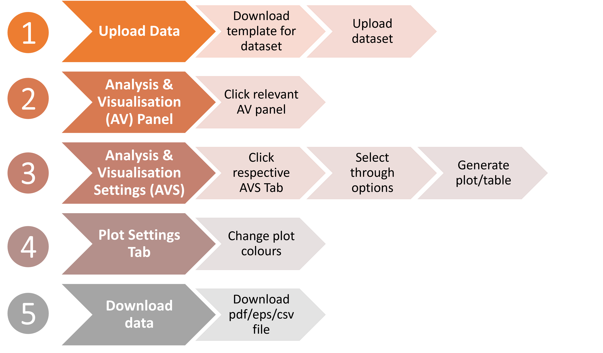{#fig-workflow}
# PERK Features {#sec-features}

-   PERK consist of several features, broadly categorized as three panels

    (1) Upload Data
    (2) Predicted
    (3) Measured
    (4) Predicted vs Measured

-   Overview of the individual panels and their options can be found in **PERK: Features** and will be discussed in the following sections.

{#fig-features}

# Upload Data {#sec-upload-data}

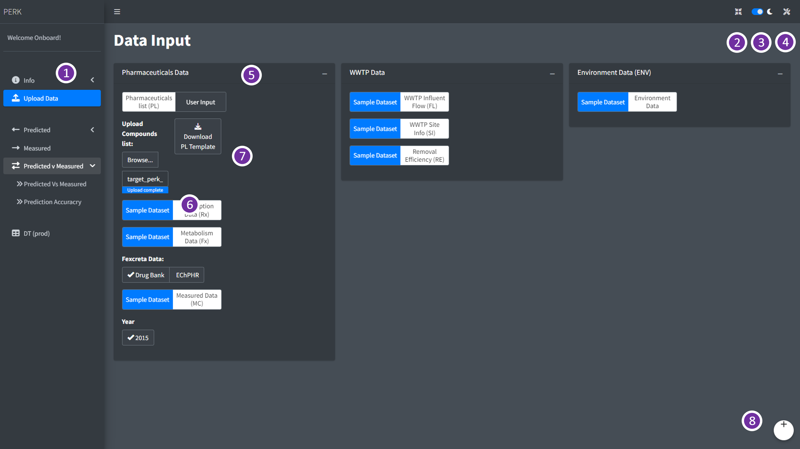{#fig-upload-data}

| Part | Remarks                               |
|------|---------------------------------------|
| 1    | Analysis and Visualisation (AV) Panel |
| 2    | Full screen                           |
| 3    | Dark and Light mode                   |
| 4    | Plot settings                         |
| 5    | Data selection Area                   |
| 6    | Upload File Button                    |
| 7    | Download Template for the file        |
| 8    | User Logout                           |

: Upload Data: Data Input {#tbl-upload-panel} 

-   In this panel, user can `Download template` for the dataset and upload in the corresponding input holders as in **PERK: Upload Data**.
-   User can click on the `Download template` button to generate the comma separated value (.csv) file.
-   Once the template is downloaded, user can add in or convert their dataset to corresponding template and upload it in the corresponding input holders to do the analysis and visualisation.

# Predicted (PC) {#sec-predicted}

```{=html}
<style type="text/css">
.caption {
    font-size: x-small;
}
</style>
```

-   Predicted (PC) panel, has two sub-panels
    (1) Prescription: to analyse and visualise the prescription trends and
    (2) Predicted Concentrations: to analyse and visualise the prediction trends based on user inputs.

## Predicted: Prescription {#sec-pred-presc}

{#fig-predicted01}

-   Different parts of the `Predicted: Prescription` sub-panel and `PERK` dashboard is highlighted in the **Predicted: Prescription - AV Panel** and listed in the **Predicted: Prescription Sub-Panel**.

-   In Prescription sub-panel, user can select the period of their interest using the `Data Range` option, and select prescription type (raw or population normalized) value using `Target type` and the site using `Select the site` options in the analysis and visualisation settings (AVS) tab, as in **Predicted: Prescription - AV Panel**

| Part | Remarks                                                                                 |
|------------|------------------------------------------------------------|
| 1    | Analysis and Visualisation (AV) Panel                                                   |
| 2    | Full screen                                                                             |
| 3    | Dark and Light mode                                                                     |
| 4    | Plot settings                                                                           |
| 5    | Plot generated based on user selection                                                  |
| 6    | Analysis and Visualisation settings (AVS) panel                                         |
| 7    | User log-out                                                                            |
| 8    | Download buttons to download the generated plot as .pdf or .eps and data as .csv format |
| 9    | Show Datatable                                                                          |

: Predicted: Prescription Sub-Panel {#tbl-pc1-panel} 

-   Prescription trends in the Predicted (PC) panel, can generate long-term month wise raw prescription trends (kg/month), as in  **PC: kg/month** and population normalized daily loads based on prescription (PNDP) (mg/day/1000 inhabitants) as in  **PC: PNDP** .

-   User can download the generated plot as publication-friendly images in .pdf/.eps format, user can also download the images in .png format and data generated for the plot as .csv file using the download buttons present below the plot.

-   User can view the data table by checking the `Show Datatable` check box present below the download buttons.

::: {layout-ncol="2"}
![PERK: Features]
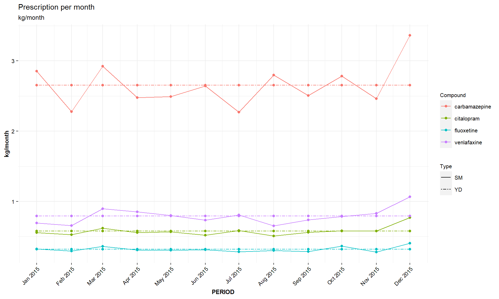{#fig-prescraw}

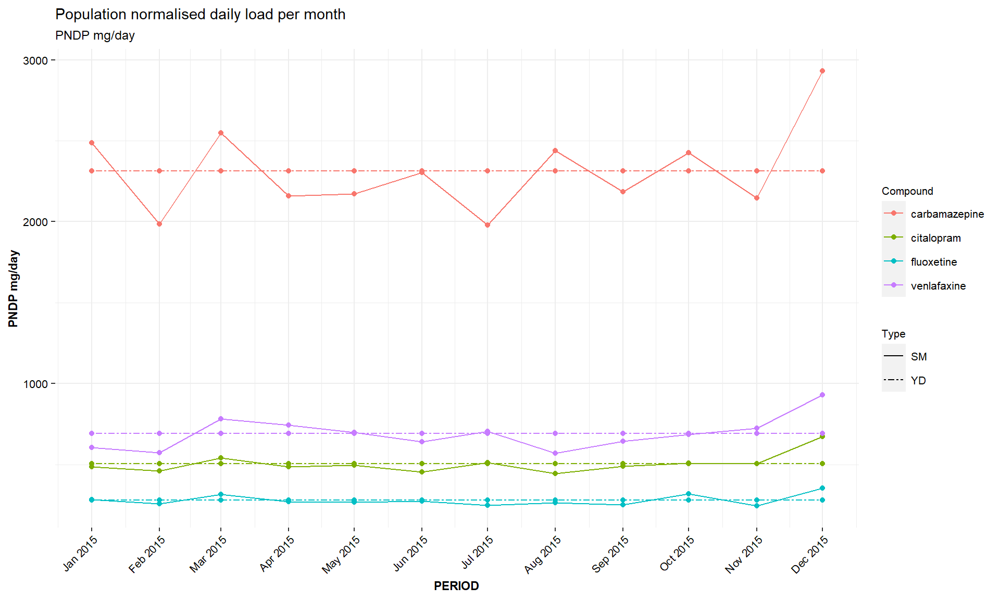{#fig-prescpndp}
:::

## Predicted: Predicted Concentration {#sec-pred-pec}

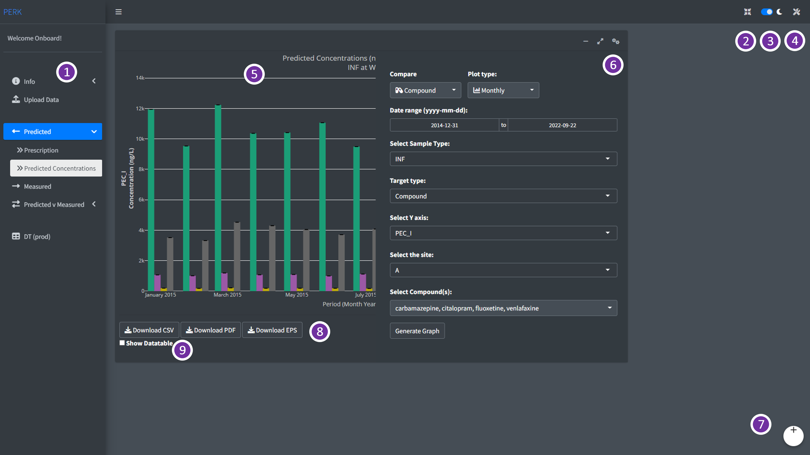{#fig-predicted02}

-   Different parts of the `Predicted: Predicted Concentrations` sub-panel and `PERK` dashboard is highlighted in the @fig-predicted02 and listed in the @tbl-pc2-panel.

| Part | Remarks                                                                                 |
|------------|------------------------------------------------------------|
| 1    | Analysis and Visualisation (AV) Panel                                                   |
| 2    | Full screen                                                                             |
| 3    | Dark and Light mode                                                                     |
| 4    | Plot settings                                                                           |
| 5    | Plot generated based on user selection                                                  |
| 6    | Analysis and Visualisation settings (AVS) panel                                         |
| 7    | User log-out                                                                            |
| 8    | Download buttons to download the generated plot as .pdf or .eps and data as .csv format |
| 9    | Show Datatable                                                                          |

: Predicted: Predicted Concentrations Sub-Panel {#tbl-pc2-panel} 

-   In the predicted concentrations sub-panel, user can select the period of their interest using the `Data Range` option, and select prediction sample type (wastewater influent `INF`, wastewater effluent `EFF` and river `RDOWN`) using `Sample type` and the site using `Select the site` options in the analysis and visualisation settings (AVS) tab, as in @fig-predicted02

-   Two types of prediction values can be visualised in this panel based on the prescription data,

    -   `PEC_I`: This prediction considers prescription based on individual month,
    -   `PEC_II`: This prediction is based on the prescription per year.

::: {layout-ncol="2"}
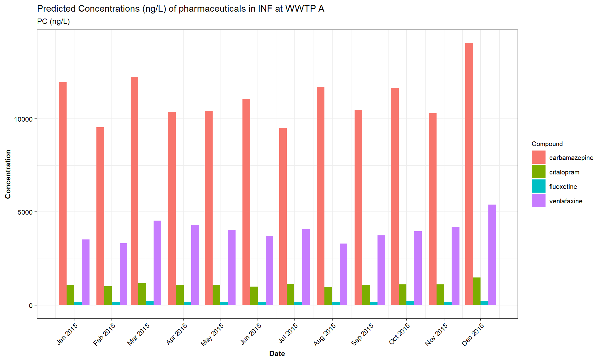{#fig-predicted03}

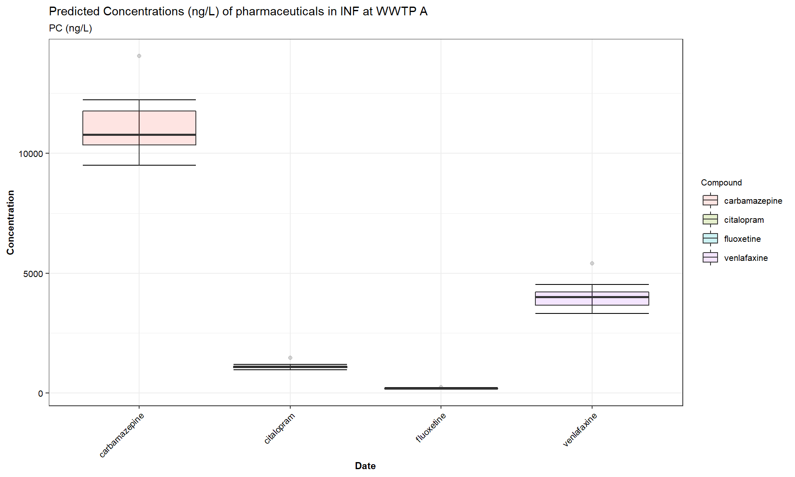{#fig-predicted04}
:::

-   This panel visualise prediction per month for the selected period `(ng/L)` as in the @fig-predicted03, and total prediction per selected period `(ng/L)`, as in the @fig-predicted04

-   In addition, this panel also enables to compare month wise and total predicted concentration of selected pharmaceuticals over different environmental matrices, such as, `INF`, `EFF` and `RDOWN` and compare over different WWTPs in the study.

-   User can download the generated plot as publication-friendly images in .pdf/.eps format, user can also download the images in .png format and data generated for the plot as .csv file using the download buttons present below the plot.

-   User can view the data table by checking the `Show Datatable` check box present below the download buttons.

## Measured (MC) {#sec-measured}

{#fig-measured01}

-   Different parts of the `Measured` tab and `PERK` dashboard is highlighted in the @fig-measured01 and listed in the @tbl-mc1-panel.

| Part | Remarks                                                                                 |
|------------------------------------|------------------------------------|
| 1    | Analysis and Visualisation (AV) Panel                                                   |
| 2    | Full screen                                                                             |
| 3    | Dark and Light mode                                                                     |
| 4    | Plot settings                                                                           |
| 5    | Plot generated based on user selection                                                  |
| 6    | Analysis and Visualisation settings (AVS) panel                                         |
| 7    | User log-out                                                                            |
| 8    | Download buttons to download the generated plot as .pdf or .eps and data as .csv format |
| 9    | Show Datatable                                                                          |

: Measured Panel {#tbl-mc1-panel} 

-   In `Measured` panel as in the @fig-measured01, user can select the period of their interest using the `Data Range` option, and select sample matrix type (`INF` - wastewater influent, `EFF` - wastewater effluent, `RDOWN` - River Downstream, `RUP` - River upstream, `SPM` - Solids) using `Sample type`, based on the user input dataset.

-   User can select the measurement type (Concentration, DL - Daily Load, PNDL - Population normalised daily load) using `Measurement Type`, and the site by `Select the site` options in the analysis and visualisation settings (AVS) tab, as in @fig-measured01

-   User can download the generated plot as publication-friendly images in .pdf/.eps format, user can also download the images in .png format and data generated for the plot as .csv file using the download buttons present below the plot.

-   User can view the data table by checking the `Show Datatable` check box present below the download buttons.

::: {layout-ncol="2"}
{#fig-mcmonth}

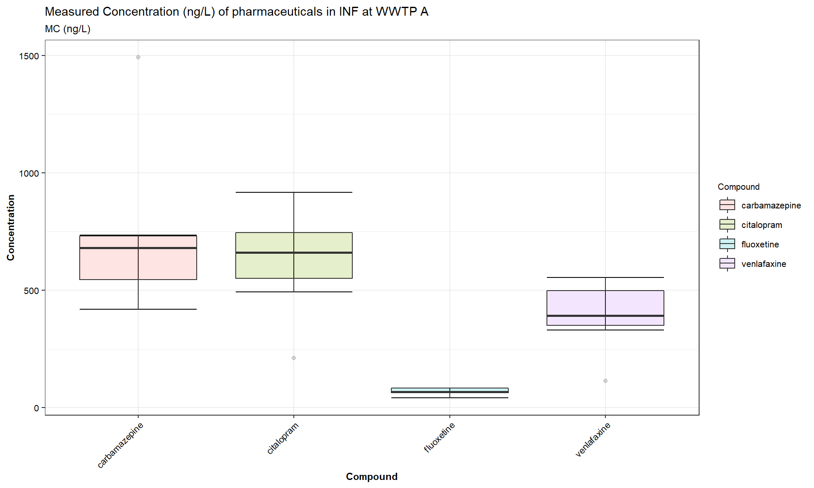{#fig-mctotal}
:::

-   Three types of measured values can be visualised in this panel based on the measurement data uploaded by the user,

    -   `Concentration (ng/L)`: This is the raw concentration values based on individual measurements.\
    -   `DL (mg/day)`: This is the Daily Load (DL) values based on measurments normalised with the daily flow of wastewater for the `INF`and `EFF`, and river for the `RDOWN` and `RUP`.
    -   `PNDL (mg/day/1000 inhabitants)`: This is the Population Normalised Daily Load values calculated based on the population in the WWTP catchment and the daily flow.

-   This panel visualise measurement per month for the selected period `(ng/L)` as in the @fig-mcmonth, and total measurement per selected period `(ng/L)`, as in the @fig-mctotal

# Predicted vs Measured {#sec-pcvsmc}

-   Predicted vs Measured (PC vs MC) panel, has two sub-panels
    (1) Predicted vs Measured: to analyse and visualise the predicted trends vs measured trends and
    (2) Prediction Accuracy - PA: to analyse and visualise the prediction accuracy.

## Predicted vs Measured: Predicted vs Measured {#sec-pcvsmc-pcvsmc}

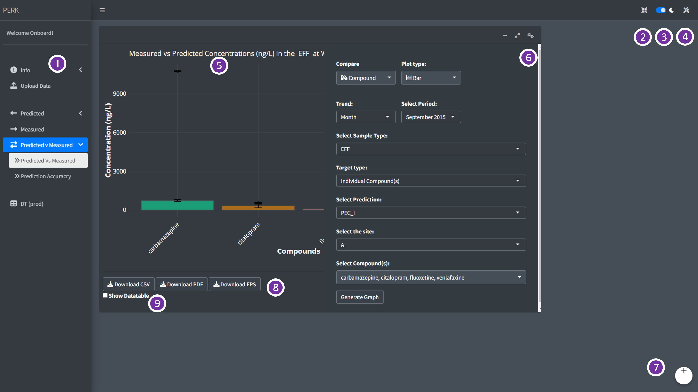{#fig-pcsvsmc01}

-   Different parts of the `Predicted vs Measured: Predicted vs Measured` sub-panel and `PERK` dashboard is highlighted in the @fig-pcsvsmc01 and listed in the @tbl-pcvsmc1-panel.

| Part | Remarks                                                                                 |
|------------------------------------|------------------------------------|
| 1    | Analysis and Visualisation (AV) Panel                                                   |
| 2    | Full screen                                                                             |
| 3    | Dark and Light mode                                                                     |
| 4    | Plot settings                                                                           |
| 5    | Plot generated based on user selection                                                  |
| 6    | Analysis and Visualisation settings (AVS) panel                                         |
| 7    | User log-out                                                                            |
| 8    | Download buttons to download the generated plot as .pdf or .eps and data as .csv format |
| 9    | Show Datatable                                                                          |

: Predicted vs Measured: Predicted vs Measured Sub-Panel {#tbl-pcvsmc1-panel} 

-   In `Predicted vs Measured` sub-panel, user can select the period of their interest using the `Select Period` option, and select sample type (wastewater influent `INF`, wastewater effluent `EFF` and river `RDOWN`) using `Select Sample type` and the site using `Select the site` options in the analysis and visualisation settings (AVS) tab, as in @fig-pcsvsmc01

-   Predicted vs Measured trends in the `Predicted vs Measured` (PCvsMC) panel, can generate measured concentration vs `PEC_I` and `PEC_II`, predictions based on monthly prescription as in @fig-pcvsmcplot1 and prediction based on the prescription per year @fig-pcvsmcplot2 respectively.

::: {layout-ncol="2"}
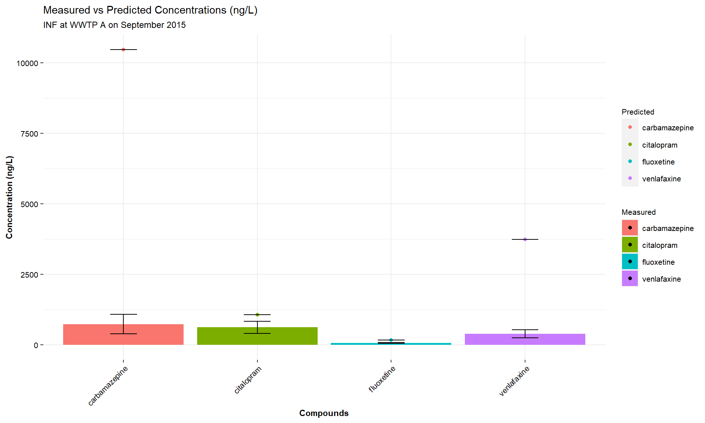{#fig-pcvsmcplot1}

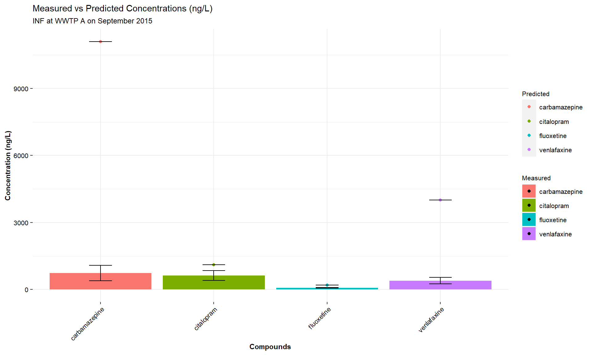{#fig-pcvsmcplot2}
:::

-   User can download the generated plot as publication-friendly images in .pdf/.eps format, user can also download the images in .png format and data generated for the plot as .csv file using the download buttons present below the plot.

-   User can view the data table by checking the `Show Datatable` check box present below the download buttons.

## Predicted vs Measured: Prediction Accuracy {#sec-pcvsmc-pa}

-   Different parts of the `Predicted vs Measured: Prediction Accuracy` sub-panel and `PERK` dashboard is highlighted in the @fig-pcsvsmc02 and listed in the @tbl-pcvsmc2-panel.

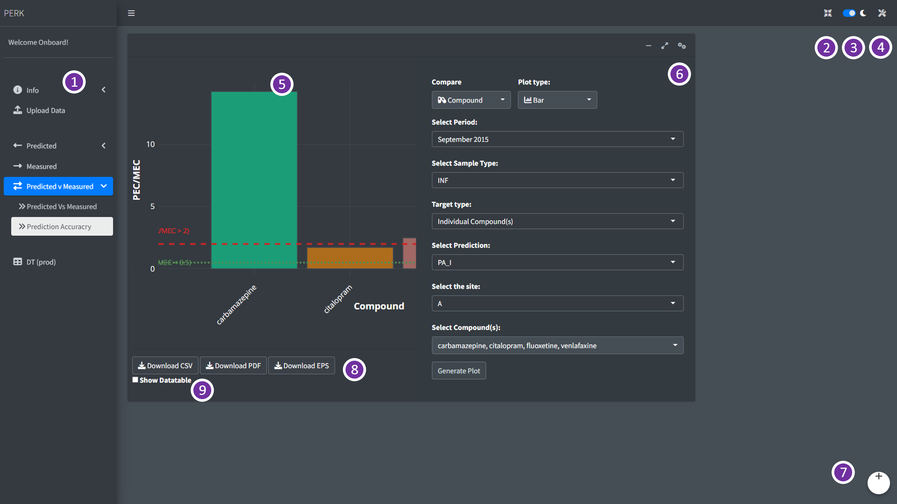{#fig-pcsvsmc02}

| Part | Remarks                                                                                 |
|------------------------------------|------------------------------------|
| 1    | Analysis and Visualisation (AV) Panel                                                   |
| 2    | Full screen                                                                             |
| 3    | Dark and Light mode                                                                     |
| 4    | Plot settings                                                                           |
| 5    | Plot generated based on user selection                                                  |
| 6    | Analysis and Visualisation settings (AVS) panel                                         |
| 7    | User log-out                                                                            |
| 8    | Download buttons to download the generated plot as .pdf or .eps and data as .csv format |
| 9    | Show Datatable                                                                          |

: Predicted vs Measured: Prediction Accuracy Sub-Panel {#tbl-pcvsmc2-panel} 

-   In `Prediction Accuracy` sub-panel, user can select the period of their interest using the `Select Period` option, and select sample type (wastewater influent `INF`, wastewater effluent `EFF` and river `RDOWN`) using `Select Sample type` and the site using `Select the site` options in the analysis and visualisation settings (AVS) tab, as in @fig-pcsvsmc02
-   Prediction Accuracy trends in the `Prediction Accuracy` (PA) panel, can generate trends in `PA_I` and `PA_II`, predictions based on monthly prescription as in @fig-paplot01 and prediction based on the prescription per year respectively.

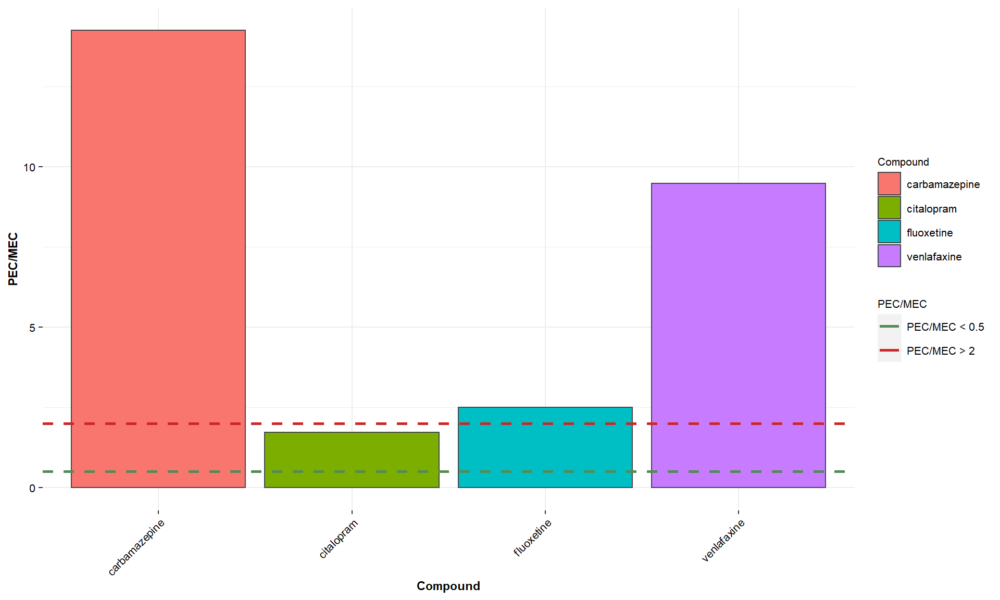{#fig-paplot01}

-   User can download the generated plot as publication-friendly images in .pdf/.eps format, user can also download the images in .png format and data generated for the plot as .csv file using the download buttons present below the plot.

-   User can view the data table by checking the `Show Datatable` check box present below the download buttons.

# Acknowledgements {#acknowledgements}

This package was built as a part of the **Wastewater Fingerprinting for Public Health Assessment (ENTRUST)** and **Innovative Pathway Control (IPC)** project funded by Wessex Water and EPSRC IAA (grant no. EP/R51164X/1).

## Disclaimer

We accept no liability for any errors in the data or its publication here: use this data at your own risk. You should not use this data to make individual prescribing decisions.

# References {.unnumbered}

::: {#refs}
:::
